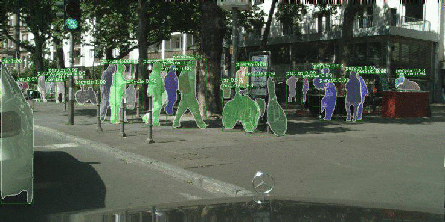
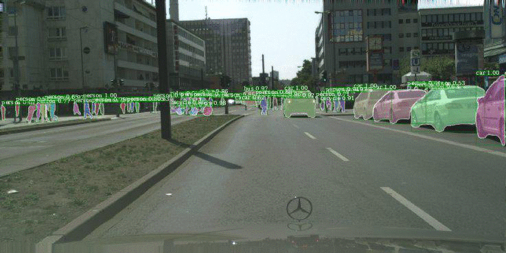
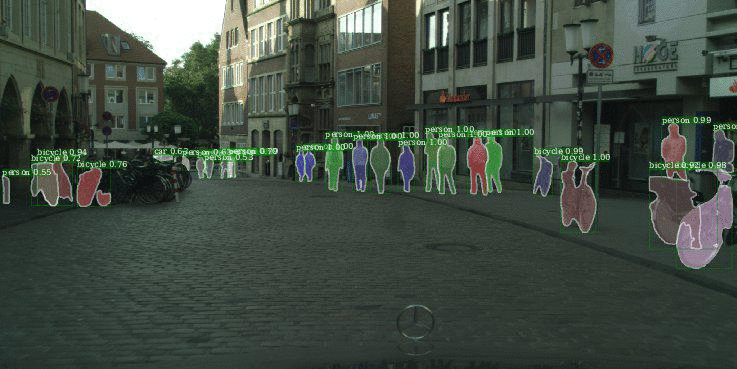

# Predicting Future Instance Segmentation by Forecasting Convolutional Features
#### Pauline Luc, Camille Couprie, Yann LeCun and Jakob Verbeek

|  |  |  |
| ---------------------- | ---------------------- | ---------------------- |


This repo contains the code for reproducing the results of our [ECCV 2018 paper](https://arxiv.org/pdf/1803.11496.pdf).


Check out more qualitative results on our [project website](http://thoth.inrialpes.fr/people/pluc/instpred2018) !

## Installation

See [SETUP.md](SETUP.md).

## Inference

We provide the models which obtained the reported results in [models/F2F](models/F2F). We recall their performance here:

<table>
  <tr>
    <td></td>
    <td colspan="3" align="center"><b>Short term</td>
    <td colspan="3" align="center"><b>Mid term</td>
  </tr>
  <tr>
    <td><b>Model</td>
    <td align="center"><b>AP-50</td>
    <td align="center"><b>AP</td>
    <td align="center"><b>IOU</td>
    <td align="center"><b>AP-50</td>
    <td align="center"><b>AP</td>
    <td align="center"><b>IOU</td>
  </tr>
  <tr>
      <td>F2F w/o f.t.</td>
      <td align="center">40.2</td>
      <td align="center">19.0</td>
      <td align="center">--</td>
      <td align="center">17.5</td>
      <td align="center">6.2</td>
      <td align="center">--</td>
  </tr>
  <tr>
      <td>F2F</td>
      <td align="center">39.9</td>
      <td align="center">19.4</td>
      <td align="center">61.2</td>
      <td align="center">19.4</td>
      <td align="center">7.7</td>
      <td align="center">41.2</td>
  </tr>
</table>


To evaluate F2F for the mid term setting on the validation set, first compute the predictions of the model using:
```
python eval.py --model models/F2F/F2F.net -nTR 3 --nb_scales 1,1,1,3 --id_gpu_model 1 \
  --save evaluate/1_evaluate_f2f_nT3
```

Next, evaluate these predictions using the evaluation script:
```
export PREDICTIONS_PATH=evaluate/1_evaluate_f2f_nT3/t+3
export EVALUATION_RESULTS=evaluate/1_evaluate_f2f_nT3_results
python eval_precomputed_results.py
```

To compute the predictions on the test set:
```
python eval.py --model models/F2F/F2F.net -nTR 3 --nb_scales 1,1,1,3 --id_gpu_model 1 \
  --save evaluate/2_evaluate_f2f_nT3_test_set --test_set True
```

## Training

First, it is best to precompute the input and target P5 features using the provided [Mask R-CNN model](models/maskrcnn/ResNet-50-FPN-coco_init_e2e_cityscapes_finetuned/) on the training and validation set, with:
```
python precompute_maskrcnn_backbone_features.py  --precompute_features fpn_res5_2_sum \
  --save compute/P5_fr3_features -nT 1
# Move the obtained features to the $PRECOMPUTED_FEATURES_DIR directory:
mv results/compute/P5_fr3_features precomputed/P5_fr3_features
```

We have included a sample of the features in [precomputed/P5_sample](precomputed/P5_sample) for you to check that you obtain the same results.

These precomputed features allow efficient training of the F2F5 model, with:

```
python train.py -lr 0.01 -trit 743 -trbs 4 --save train/1_f2f5_nT1 \
  -nEps 10 -tsl fpn_res5_2_sum  --nb_scales 1 -nTR 1 -nEp 80 --create_subdir True
# Note: --create_subdir True makes sure that results and logs are stored in a new subdir each time the script is run.
```

Next, you can use the obtained model as initialization to train the other subnetworks of F2F, i.e. F2F4, F2F3 and F2F2.
Adapt the path to the F2F5 weights below and launch the training of each subnetwork with:

```
# USERTODO : uncomment one of the following
#F2F5_WEIGHTS=results/train/1_f2f5_nT1/[FILL IN]/model_80ep.net # your pretrained F2F5
#F2F5_WEIGHTS=models/F2F/single_levels/F2F5_no_ar_ft.net # the F2F5 model we provide

# Training F2F4 initialized with F2F5's weights
python train.py --nb_scales 1 -lr 0.005 -nEp 80 -tsl fpn_res4_5_sum --id_gpu_model 1 -nTR 1 \
  --save train/2_ft_f2f5_for_p4_nT1 --model $F2F5_WEIGHTS --create_subdir True

# Training F2F3 initialized with F2F5's weights
python train.py --nb_scales 1 -lr 0.01 -nEp 80 -tsl fpn_res3_3_sum --id_gpu_model 1 -nTR 1 \
  --save train/3_ft_f2f5_for_p3_nT1  --model $F2F5_WEIGHTS --create_subdir True

# Training F2F2, coarse subnet initialized with F2F5's weights
python train.py --nb_scales 3 -lr 0.00005 -nEp 30 -tsl fpn_res2_2_sum --id_gpu_model 1 -nTR 1 \
  --save train/4_ft_f2f5_for_p2_nT1 --model $F2F5_WEIGHTS --optim_algo adam --create_subdir True
```

Finally, to finetune each subnetwork autoregressively, adapt the paths to the corresponding subnetwork weights and launch each of the following jobs:

```
# First precompute the P5 features for nT = 3
python precompute_maskrcnn_backbone_features.py  --precompute_features fpn_res5_2_sum \
  --save compute/P5_fr3_features -nT 3

# Finetuning F2F5 autoregressively
F2F5_WEIGHTS=... # USERTODO : fill in with the adequate path
python train.py --nb_scales 1 -lr 5e-4 -nEp 60 -tsl fpn_res5_2_sum --id_gpu_model 1 -nTR 3 \
   --save train/5_ft_f2f5_ar_nT3 --model $F2F5_WEIGHTS --create_subdir True

# Finetuning F2F4 autoregressively
F2F4_WEIGHTS=... # USERTODO : fill in with the adequate path
python train.py --nb_scales 1 -lr 1e-4 -nEp 10 -nEps 1 -tsl fpn_res4_5_sum  --id_gpu_model 1 -nTR 3 \
  --save train/6_ft_f2f4_ar_nT3 --model $F2F4_WEIGHTS --create_subdir True

# Finetuning F2F3 autoregressively
F2F3_WEIGHTS=... # USERTODO : fill in with the adequate path
python train.py --nb_scales 1 -lr 2e-4 -nEp 10 -nEps 1 -tsl fpn_res3_3_sum --id_gpu_model 1 -nTR 3 \
  --save train/7_ft_f2f3_ar_nT3 --model $F2F3_WEIGHTS --create_subdir True

# Finetuning F2F2 autoregressively
F2F2_WEIGHTS=... # USERTODO : fill in with the adequate path
python train.py --nb_scales 3 -lr 1e-5 -nEp 10 -nEps 1 -tsl fpn_res2_2_sum --id_gpu_model 1 -nTR 3 \
  --save train/8_ft_f2f2_ar_nT3 --model $F2F2_WEIGHTS --optim_algo adam --create_subdir True
```

Finally, you need to assemble the subnetworks into the F2F architecture, using the following (adapted) command:
```
export F2F5_WEIGHTS=... # USERTODO : fill in with the adequate path
export F2F4_WEIGHTS=... # USERTODO : fill in with the adequate path
export F2F3_WEIGHTS=... # USERTODO : fill in with the adequate path
export F2F2_WEIGHTS=... # USERTODO : fill in with the adequate path
python assemble_models.py --nb_scales 1,1,1,3 --save other/1_assemble_F2F_model
```

## Results

For ease of comparison with our work, we provide the predictions of our models on the Cityscapes [1] validation set.
- For 3 frames ahead (about 0.17s). [[Download]](precomputed/predictions/f2f_nT1_ishexcx9to.tar.gz)
This one is obtained by taking frames 8, 11, 14, 17 of each sequence in input and predicting frame 20. These are the predictions of the model before autoregressive finetuning, which get 40.2 AP-50.
- For 9 frames ahead (about 0.51s). [[Download]](precomputed/predictions/f2f_ft_nT3_t%2B3_qqu04edgr0.tar.gz) Intermediate predictions are also provided ([3 frames](precomputed/predictions/f2f_ft_nT3_t%2B1_qqu04edgr0.tar.gz) and [6 frames](precomputed/predictions/f2f_ft_nT3_t%2B2_qqu04edgr0.tar.gz)).
These are obtained by taking frames 2, 5, 8, 11 of each sequence in input, and predicting frames 14, 17, 20. These are the predictions of the autoregressively finetuned model, which get 19.4 AP-50% and 41.2 mIOU over the moving classes. The second result is obtained by converting the instance segmentations to semantic segmentations using the simple procedure we describe in the paper, with threshold=0.5. We have also used this threshold for all our visualizations.

*[1] Cordts, M., Omran, M., Ramos, S., Rehfeld, T., Enzweiler, M., Benenson, R., Franke, U., Roth, S., Schiele, B.: The Cityscapes dataset for semantic urban scene understanding. CVPR 2016*

## License 
This project is licensed under the [CC-BY-NC 4.0 licensing](https://creativecommons.org/licenses/by-nc/4.0/legalcode). Please refer to the LICENSE file in the root directory of this project. By contributing to this project, you agree that your contributions will be licensed under this LICENSE file.
